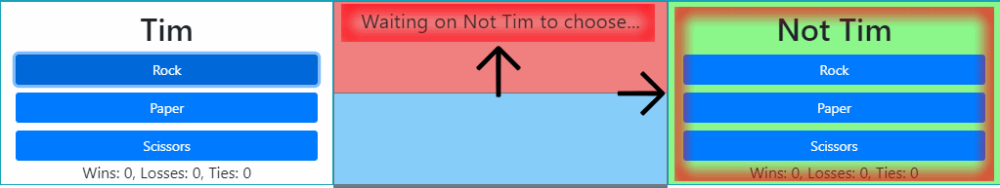

# RPS-Multiplayer
---
# [Click to play.](https://timlukens.com/RPS-Multiplayer)
___

## Step 1:

#### Start by entering your name into the Your Name: field. You can submit with the submit button or by pressing enter while in the input field.

---

## Step 2:

#### Once both players are in the game player 1 can make their selection.

---

## Step 3:

#### Then its player 2's turn.

---

## Step 4:

#### The outcome is decided depending on which selection each player made.

---

# Chat:

#### Chat is fully functional

___

# Queue System
## (Work in Progress...)

#### When a player joins and submits their name, but both player spots are already taken they are added to a queue. The system isnt fully functional, but if one player leaves the next person in queue will be put into their spot.

##### Currently when the last person in the queue leaves the queue it is not removed. Also, if someone is front of someone in the queue and they leave it can break the functionality when the person that left is called.